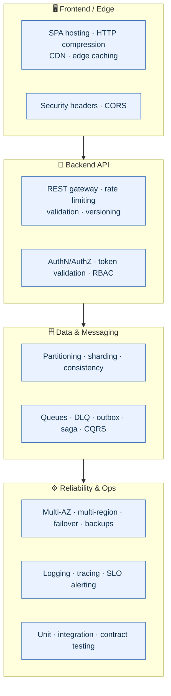
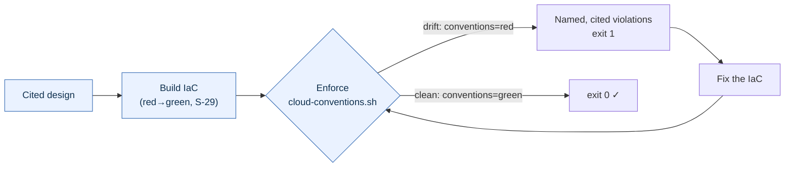

# Demo: the Cloud Architect turns a plain-language vision into a fully-cited, world-class architecture

This is a real, reproducible run of the plugin cloud-architect feature. A non-technical founder describes an app in plain English; the plugin guides them, then produces a complete full-stack + cloud architecture in which **every decision is justified by a cited, world-class source** (cite-or-decline). Nothing below is hand-written — it is the tool output.

## The founder words

> "A world-class full-stack consumer marketplace for international users — fast and responsive, scalable and cost-effective — deployed to AWS."

## What the plugin designs from that one sentence (16 cited layers)



*51 decisions across these layers — **every one cites a tier-1 source**, listed in full below.*

## Step 1 — the plugin guides the founder (Listen, Probe, Clarify)

When the picture is incomplete, the entry function asks the next question instead of guessing:

```
$ architect-session.sh --vision "a marketplace app" --answer criticality=mission-critical
session_complete=false
next_question=motivation
```

It keeps asking until it understands the business need, then translates that need into a technical design.

## Step 2 — the resulting full-stack + cloud architecture (every decision cited)

### Frontend / UI

- **spa_hosting** — justified by `aws-well-architected`
- **http_compression** — justified by `aws-well-architected`

### Backend API

- **rest_api_gateway** — justified by `microsoft-rest-api-guidelines`
- **rate_limiting** — justified by `microsoft-rest-api-guidelines`
- **request_validation** — justified by `microsoft-rest-api-guidelines`
- **api_versioning** — justified by `microsoft-rest-api-guidelines`

### Database

- **eventual_consistency** — justified by `patterns-of-distributed-systems`
- **partitioning** — justified by `azure-data-store-models`
- **sharding** — justified by `azure-data-store-models`

### Messaging & Integration

- **message_queue** — justified by `enterprise-integration-patterns`
- **dead_letter_queue** — justified by `enterprise-integration-patterns`
- **outbox_pattern** — justified by `enterprise-integration-patterns`
- **anti_corruption_layer** — justified by `enterprise-integration-patterns`
- **contract_test** — justified by `enterprise-integration-patterns`

### Real-time

- **websocket_gateway** — justified by `enterprise-integration-patterns`
- **connection_auth** — justified by `oauth2-oidc`

### Authentication & Authorization

- **authentication** — justified by `oauth2-oidc`
- **authorization_rbac** — justified by `owasp-asvs`
- **token_validation** — justified by `owasp-asvs`

### Object Storage

- **object_storage_encryption** — justified by `nist-800-53`
- **public_access_block** — justified by `nist-800-53`
- **bucket_versioning** — justified by `aws-well-architected`
- **lifecycle_policy** — justified by `aws-well-architected`

### Edge / HTTP Headers

- **security_headers** — justified by `owasp-secure-headers`
- **cors_policy** — justified by `owasp-secure-headers`

### Performance

- **autoscaling** — justified by `aws-well-architected`
- **caching** — justified by `aws-well-architected`
- **cdn** — justified by `aws-well-architected`
- **edge_caching** — justified by `aws-well-architected`

### Reliability & Global Delivery

- **multi_az** — justified by `aws-reliability-pillar`
- **automated_failover** — justified by `aws-reliability-pillar`
- **health_check** — justified by `aws-reliability-pillar`
- **frequent_backup** — justified by `aws-rpo-rto-targets`
- **multi_region** — justified by `aws-reliability-pillar`
- **latency_based_routing** — justified by `aws-reliability-pillar`

### Security

- **encryption_at_rest** — justified by `nist-800-53`
- **encryption_in_transit** — justified by `nist-800-53`
- **access_control** — justified by `nist-800-53`

### Observability (Logging & Analysis)

- **monitoring** — justified by `google-sre-book`
- **centralized_logging** — justified by `opentelemetry-docs`
- **distributed_tracing** — justified by `opentelemetry-docs`
- **slo_alerting** — justified by `google-sre-book`
- **access_logging** — justified by `nist-800-53`

### Testing

- **unit_testing** — justified by `fowler-test-pyramid`
- **integration_testing** — justified by `fowler-test-pyramid`
- **contract_testing** — justified by `enterprise-integration-patterns`

### Dependency Versioning (Futureproofing)

- **dependency_pinning** — justified by `semver`
- **automated_dependency_updates** — justified by `google-eng-practices`
- **compatibility_testing** — justified by `semver`

### Distributed-Systems Patterns

- **saga** — justified by `fowler-event-sourcing`
- **event_sourcing** — justified by `fowler-event-sourcing`

## Proof: world-class, fully cited

- **51 architectural decisions**, and **every one is cited** (the design carries `needs_grounding: []`).
- **17 distinct world-class authorities** justify the design:

  - `aws-reliability-pillar`
  - `aws-rpo-rto-targets`
  - `aws-well-architected`
  - `azure-data-store-models`
  - `enterprise-integration-patterns`
  - `fowler-event-sourcing`
  - `fowler-test-pyramid`
  - `google-eng-practices`
  - `google-sre-book`
  - `microsoft-rest-api-guidelines`
  - `nist-800-53`
  - `oauth2-oidc`
  - `opentelemetry-docs`
  - `owasp-asvs`
  - `owasp-secure-headers`
  - `patterns-of-distributed-systems`
  - `semver`

The full set of authorities the feature is educated from is registered in `standards/cloud-architecture-sources.yaml` and `standards/cloud-engineering-sources.yaml` and listed in `standards/SOURCES.md`.

## Reproduce it yourself

```bash
export CLAUDE_PLUGIN_ROOT="$PWD"
# 1) guided intake (asks the next question until complete)
bash commands/architect-session.sh --vision "a marketplace app" --answer criticality=mission-critical --out-dir /tmp/demo
# 2) the full design for the canonical scenario (the golden reference)
bash commands/business-translate.sh \
  --profile standards/golden/fullstack-international-aws-profile.json \
  --out /tmp/design.json
# every concern in /tmp/design.json carries a source_id and grounding=grounded
```

## Breadth: not one scenario, not one cloud

The run above is AWS. The same engine is **multi-cloud** and **multi-archetype** —
two more persisted, byte-reproducible golden references prove it:

- **One vision → three clouds.** The same marketplace vision, driven through each
  platform boundary, yields three platform-correct plans — AWS (`aws-well-architected-tool`
  / Terraform), Azure (`azure-advisor` / Bicep), GCP (`gcp-recommender` / Terraform) —
  each validated, fully grounded, and safe-by-default (no external mutation without
  `--apply`). See [docs/golden/multicloud-comparison.md](golden/multicloud-comparison.md).
- **A different business → a different design.** A HIPAA medical-clinic booking app
  (regulated, strongly-consistent, partner-integrated) produces a *different* 43-decision
  design — uniquely pulling in `strong_consistency`, `synchronous_replication`,
  `audit_logging`, `audit_log_retention`, and `mfa`, while correctly omitting the
  public-edge concerns. Driver-traceable, fully cited. See
  [docs/golden/healthcare-booking-hipaa-architecture.md](golden/healthcare-booking-hipaa-architecture.md).

This is the difference between a template and an architect: the design changes
because the *business profile* changed.

## The enforcement half: catching drift, not just generating once

Generation is only half the job. The same plugin **enforces** the architecture it
designs: `cloud-conventions.sh` (S-30) lints the actual IaC against grounded
convention rules — each rule citing a tier-1 source — and fails on drift. This is
real, reproducible output:




```bash
# DRIFT: a Terraform file with an unrestricted-ingress rule and no version pin
$ cat > main.tf <<'EOF'
resource "aws_security_group" "web" {
  ingress { cidr_blocks = ["0.0.0.0/0"] }
}
EOF
$ bash commands/cloud-conventions.sh --tool terraform --iac main.tf
violation=tf-pin-terraform-version
violation=tf-declare-required-providers
violation=tf-document-variables
violation=tf-tag-resources
violation=tf-no-unrestricted-ingress      # grounded in aws-prescriptive-security
conventions=red
convention_violations=5                    # exit 1
```

Fix the drift — pin the version, declare providers, describe variables, tag
resources, restrict ingress — and the same gate goes green:

```bash
$ bash commands/cloud-conventions.sh --tool terraform --iac main.tf
conventions=green
convention_violations=0                     # exit 0
```

Every violation names the rule **and** the source that justifies it (cite-or-decline:
a rule whose source isn't in any catalog is itself rejected). Rulesets ship for
Terraform, Bicep, CloudFormation, observability, and DoD zero-trust
(`standards/cloud-conventions/`).

> **Status note (honest):** the enforcement *engine* is built, grounded, and
> test-covered, and it is now wired into **all three execution surfaces** with the
> same exit-code contract: invoked directly, exposed in `/doctor`
> (`doctor.sh --check cloud-conventions --root <dir>`, §27.28), and run as a CI step
> in `closed-loop.yml` (§27.29). Safe-by-default: a repo with no cloud IaC is a green
> no-op, so non-cloud repos are never regressed; CI fails only on real IaC drift. M6
> is complete.

## How this is guaranteed (not a one-off)

A standing conformance contract (architecture section 27.27) requires **every** cloud-architecture design the plugin produces to be fully cited. It is enforced by cite-or-decline, gated by the end-to-end integration suites (`evals/specs/cl459-e2e-*` through `cl464-e2e-*`), and pinned by the golden reference in `standards/golden/` and `docs/golden/`. The full test suite is **4,175 passing / 0 failing**.
