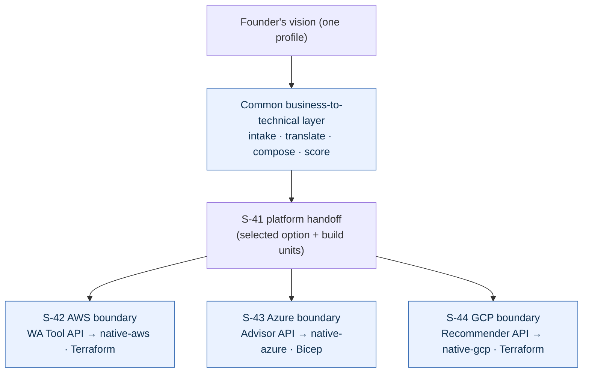

# Golden reference: one vision, three clouds (AWS · Azure · GCP)

This is **real, reproducible tool output** — not hand-written. The *same* founder
vision is driven through the common business-to-technical layer once, then handed
to each of the three platform boundaries (S-42 / S-43 / S-44). The common design
is shared (the Well-Architected pillars are cross-cloud); what each boundary adds
is platform-specific: the **native advisory API** it normalizes, the **IaC target**
it builds to, and **native-source citations**. The persisted artifacts live under
`standards/golden/multicloud/` (e.g.
[`aws-boundary-response.json`](../../standards/golden/multicloud/aws-boundary-response.json),
[`azure-boundary-response.json`](../../standards/golden/multicloud/azure-boundary-response.json),
[`gcp-boundary-response.json`](../../standards/golden/multicloud/gcp-boundary-response.json)).

## The shared vision

> "A world-class full-stack consumer marketplace for international users — fast and
> responsive, scalable and cost-effective." (profile:
> [`standards/golden/fullstack-international-aws-profile.json`](../../standards/golden/fullstack-international-aws-profile.json))

## What each platform boundary produces from that one vision

| | **AWS boundary** (S-42) | **Azure boundary** (S-43) | **GCP boundary** (S-44) |
|---|---|---|---|
| Native advisory API normalized | `aws-well-architected-tool` | `azure-advisor` | `gcp-recommender` |
| IaC target | Terraform | Bicep | Terraform |
| Validated before any external call | ✅ `validated=true` | ✅ `validated=true` | ✅ `validated=true` |
| Mutating call made? (safe-by-default) | ❌ `applied=false` | ❌ `applied=false` | ❌ `applied=false` |
| Native findings normalized | 2 → `native-aws` | 2 → `native-azure` | 2 → `native-gcp` |
| Ungrounded findings | 0 | 0 | 0 |
| Shared build units (common design) | 18 | 18 | 18 |

Every native finding is mapped to a grounded common concern (`grounding=grounded`);
a finding that could not be mapped would be marked `needs_grounding` (cite-or-decline).
No boundary issues a mutating external call without an explicit `--apply` **after**
validation passes (§27.19 Contract A) — the responses above are all `applied=false`.



## Reproduce it yourself

```bash
export CLAUDE_PLUGIN_ROOT="$PWD"
cp standards/golden/fullstack-international-aws-profile.json /tmp/profile.json
cd /tmp
bash "$CLAUDE_PLUGIN_ROOT/commands/architect-session.sh" \
  --vision "international marketplace" --profile profile.json --out-dir sess --now 2026-06-08T00:00:00Z
printf '{"review_ref":"native-review/marketplace-workload","recommendations":[{"id":"SEC-1","title":"Enable encryption at rest","pillar":"security","severity":"HIGH"},{"id":"REL-1","title":"Enable multi-AZ redundancy","pillar":"reliability","severity":"MEDIUM"}]}' > native.json
for P in aws azure gcp; do
  bash "$CLAUDE_PLUGIN_ROOT/commands/platform-boundary.sh" \
    --options sess/architecture-options.json --select opt-balanced --platform $P --out $P-handoff.json
  bash "$CLAUDE_PLUGIN_ROOT/commands/$P-boundary.sh" \
    --handoff $P-handoff.json --native-response native.json --out $P-boundary-response.json --now 2026-06-08T00:00:00Z
done
# each $P-boundary-response.json is byte-identical to standards/golden/multicloud/$P-boundary-response.json
```

## Why this matters

The multi-cloud claim is not a slogan — the same vision deterministically yields
three platform-correct, fully-grounded, safe-by-default deployment plans, each
normalized to that vendor's own advisory API and IaC dialect. The boundaries
**enrich** the common grounded design; they never replace it, and they never act
on an unvalidated or unknown option.
